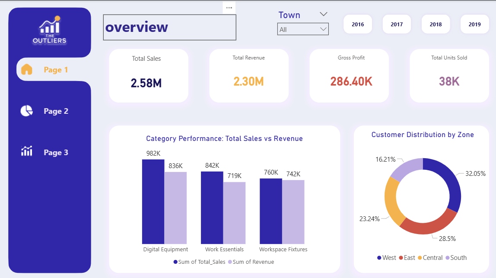
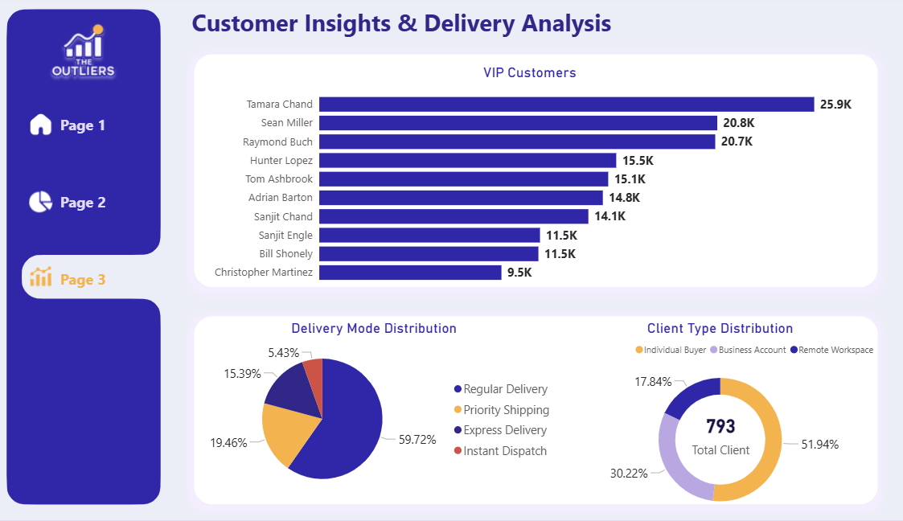

# 📊 Report Insights & Analysis

This document provides detailed insights and analysis for each dashboard page in the BrainLytics Power BI project. Each section includes screenshots, explanations, key metrics, and business findings.

---

## Table of Contents
1. [Overview Dashboard](#1-overview-dashboard)
2. [Sales &Profit Analysis](#2-sales-analysis)
3. [Customer Insights](#3-customer-insights)
8. [Key Business Recommendations](#key-business-recommendations)

---

## 1. Overview Dashboard

### Page Description
The Overview Dashboard serves as the landing page, providing executives with a high-level view of the most critical business metrics. It offers a quick snapshot of overall performance and highlights areas requiring attention.

### Key Metrics Displayed
- **Total Sales**: 2.58M
- **Total Revenue**: 2.30M
- **Gross Profit**: 286.40K
- **Total Units Sold**: 38K

### Visualizations
1. **KPI Cards**  
   High-level metrics showing total sales, revenue, profit, and units sold.

2. **Category Performance: Total Sales vs Revenue**  
   A dual bar chart comparing sales and revenue across the three main product categories:
   - Digital Equipment  
   - Work Essentials  
   - Workspace Fixtures  

3. **Customer Distribution by Zone**  
   A donut chart showing customer share percentages across the four geographic zones:
   - West  
   - East  
   - Central  
   - South  

---

### Interactive Elements
- **Town Slicer**  
- **Year Slicers (2016, 2017, 2018, 2019)**

---

## Key Insights

### 📈 Sales & Revenue Performance
- The business recorded **2.58M in total sales**, supported by **2.30M in total revenue**, reflecting strong customer activity.
- The gap between sales and revenue indicates areas where pricing strategy or operational costs can be optimized for better profitability.

---

### 🛒 Category Performance
- **Digital Equipment** leads significantly with **982K in total sales**, outperforming all other categories.
- **Work Essentials** (842K) and **Workspace Fixtures** (760K) show balanced and steady performance with closely aligned revenue results.
- The distribution of category performance suggests a well-diversified product portfolio with no heavy dependency on a single product line.

---

### 🌍 Customer Distribution Insights
- The **West Zone** holds the largest customer share (**32.05%**), marking it as the dominant region.
- **East Zone** follows with **28.5%**, reflecting strong engagement.
- Lower customer shares in the **Central (23.24%)** and **South (16.21%)** zones indicate potential for regional expansion and targeted marketing strategies.

---

### 💰 Profitability
- Gross Profit of **286.40K** demonstrates healthy earnings relative to revenue.
- Profit margins appear stable but can be improved further in regions or categories with higher operational costs.

---

### 🎯 Business Recommendations
1. **Expand in Lower-Performing Zones**: Focus marketing efforts in Central and South zones to grow customer base.  
2. **Maximize Digital Equipment Success**: Leverage top category performance by offering bundles, accessories, or premium options.  
3. **Improve Profit Efficiency**: Analyze product costs and pricing strategies to reduce the gap between revenue and profit.  
4. **Leverage Year Slicers**: Use yearly comparisons to identify peak periods and forecast demand more accurately.

---

## 2. Sales & Profit Analysis

### Page Description
The Sales & Profit Analysis page provides a focused, in-depth view of profitability trends, quarterly category performance, and gross profit distribution. It helps identify which product lines generate the strongest contribution and how profit evolves over time.

---

### Key Metrics Displayed
- **Profit Margin:** 11%
- **Gross Profit:** Varies by category (Digital Equipment, Work Essentials, Workspace Fixtures)
- **Profit Trend Over Time:** Month-to-month profit fluctuations

---

### Visualizations

1. **Profit Trend Over Time**  
   A monthly line chart showing a gradual decline in profit from December through January, highlighting periods of reduced profitability.

2. **Quarterly Sales Contribution by Product Category**  
   A stacked column chart illustrating how each product category contributes to overall quarterly sales (Q1–Q4).

3. **Profit Margin Gauge**  
   A simple and clear indicator showing an overall **11%** profit margin.

4. **Gross Profit by Product Category**  
   A bar chart comparing the gross profit of:
   - **Digital Equipment:** 145K  
   - **Work Essentials:** 122K  
   - **Workspace Fixtures:** 18K  

---

## Key Insights

### 📉 Profit Trend Insights
- Profit shows a **steady downward trend** across the observed months, indicating potential increases in operational costs or seasonal demand drops.
- The sharpest decline occurs between **May → August**, suggesting mid-year performance challenges.
- Stabilization begins around **November–December**, but profit remains lower than earlier periods.

---

### 🟪 Quarterly Sales Contribution (Category-Level)
- **Q4** is the strongest quarter, showing the highest combined contribution across all categories.  
- **Digital Equipment** consistently contributes a significant portion each quarter, especially in Q4.
- **Work Essentials** shows steady growth from Q1 to Q4, indicating stable and increasing demand.
- **Workspace Fixtures** contributes the least but still shows improvement in Q4.

---

### 💰 Gross Profit by Category
- **Digital Equipment** is the clear leader with **145K gross profit**, generating the highest returns.
- **Work Essentials** follows closely at **122K**, reflecting strong demand and profitability.
- **Workspace Fixtures** has the **lowest profit (18K)**, signaling potential issues with pricing, demand, or cost structure.

---

### 🧮 Profit Margin Indicator
- An overall **11% profit margin** indicates moderate profitability.
- Given the strong sales shown on other pages, this suggests opportunities for:
  - Cost reduction,
  - Better pricing strategies,
  - Or optimizing low-performing product categories.

---

## 🎯 Business Recommendations

1. **Investigate Mid-Year Cost Drivers**  
   The decline from May–August suggests the need to review seasonal expenses, pricing, or supply chain factors.

2. **Leverage Q4 Strength**  
   Since Q4 shows the strongest performance, consider aligning promotions and inventory planning toward this period.

3. **Boost Workspace Fixtures Performance**  
   With only **18K profit**, this category may need:
   - Revised pricing,  
   - Better bundling strategies,  
   - Or targeted marketing.

4. **Maintain Digital Equipment Momentum**  
   This category is a major profit driver—invest in upsells, accessories, and extended warranties.

5. **Enhance Profit Margin Strategy**  
   Explore reducing low-margin products or bundling to increase overall margins above 11%.

---

## 3. Customer Insights & Delivery Analysis

### Page Description
This page provides a comprehensive view of customer behavior, top VIP customers, preferred delivery modes, and customer type segmentation. It helps identify high-value clients, analyze customer distribution patterns, and understand how customers prefer to receive their orders.

---

### Key Metrics Displayed
- **Top VIP Customers** with total spending
- **Total Clients:** 793
- **Client Type Distribution:** Individual Buyer, Business Account, Remote Workspace
- **Delivery Mode Distribution:** Regular, Priority, Express, Instant Dispatch

---

### Visualizations

1. **VIP Customers Ranking**  
   A horizontal bar chart showing the top 10 highest-spending customers, led by:
   - **Tamara Chand:** 25.9K  
   - **Sean Miller:** 20.8K  
   - **Raymond Buch:** 20.7K  

2. **Delivery Mode Distribution**  
   A pie chart illustrating how customers prefer to receive their orders:
   - **Regular Delivery:** 59.72%  
   - **Priority Shipping:** 19.46%  
   - **Express Delivery:** 15.39%  
   - **Instant Dispatch:** 5.43%  

3. **Client Type Distribution**  
   A donut chart showing the percentage of each customer type:
   - **Individual Buyer:** 51.94%  
   - **Business Account:** 30.22%  
   - **Remote Workspace:** 17.84%  

4. **Total Clients KPI:**  
   A central indicator showing the full customer base: **793 clients**

---

## Key Insights

### ⭐ VIP Customer Insights
- **Tamara Chand** is the top customer with **25.9K** in spending — significantly higher than the rest.
- The top three customers contribute a large share of total VIP revenue, indicating a strong concentration among high-value clients.
- Customers ranked 7–10 (Sanjit Chand → Christopher Martinez) spend between **9.5K–14.1K**, showing a steady long tail of mid-tier buyers.

---

### 🚚 Delivery Mode Insights
- **Regular Delivery dominates (59.72%)**, making it the preferred option for most customers.
- **Priority Shipping (19.46%)** and **Express Delivery (15.39%)** together represent over one-third of orders, indicating a strong need for faster shipping options.
- **Instant Dispatch (5.43%)** is niche but important for urgent purchases — potential area for improvement or premium pricing.

---

### 👥 Customer Type Insights
- **Individual Buyers** form the majority at **51.94%**, showing strong consumer-driven demand.
- **Business Accounts** make up **30.22%**, representing a critical customer segment with likely higher-order value and frequent purchases.
- **Remote Workspace customers (17.84%)** highlight a growing trend of work-from-home setups, especially post-2018.

---

## 🎯 Business Recommendations

1. **Strengthen VIP Customer Management**  
   Introduce loyalty perks, exclusive deals, and personalized offers for top spenders.

2. **Enhance Fast Delivery Options**  
   Since 35%+ of clients prefer Priority/Express, consider improving delivery SLAs or offering premium tiers.

3. **Focus Marketing on Individual Buyers**  
   As they form half of the customer base, targeted marketing can drive higher repeat purchases.

4. **Grow Business Accounts Segment**  
   Provide bulk discounts or subscription plans to expand the highest-value commercial clients.

5. **Explore Remote Workspace Opportunities**  
   Bundle products that support home offices and promote targeted offers for remote workers.

6. **Optimize Instant Dispatch**  
   With 5.43% usage, this can be turned into a profitable premium feature with guaranteed same-day service.

---

## Key Business Recommendations

Based on the combined insights from Sales, Profit, Customer, and Delivery dashboards, here are the most impactful strategic actions:

### 🎯 Immediate Priorities (0–3 Months)
1. **Strengthen High-Value Customer Relationships**
   - Focus on top VIP customers to increase retention.
   - Offer targeted incentives and personalized follow-ups for high-spending accounts.

2. **Improve Underperforming Product Areas**
   - Review pricing and marketing for Workspace Fixtures (lowest profitability).
   - Expand inventory and promotions for top-performing categories like Digital Equipment.

3. **Enhance Delivery Experience**
   - Since Regular Delivery dominates (59%), optimize its speed and reliability.
   - Introduce premium upsell options for Priority and Express shipments.

---

### 📈 Short-Term Initiatives (3–6 Months)
4. **Regional Growth Strategy**
   - Increase marketing efforts in Central and South zones with lower customer share.
   - Create regional promotions to balance distribution across all zones.

5. **Customer Mix Optimization**
   - Build targeted campaigns for Business Accounts (30%) to increase high-value orders.
   - Expand offerings tailored for Remote Workspace users (growing segment).

6. **Profit Margin Improvement**
   - Review cost structure for mid-year months where profit declines.
   - Explore bundling strategies to increase the average order value.

---

### 🚀 Long-Term Strategy (6–12 Months)
7. **Customer Segmentation & Personalization**
   - Develop tailored experiences for Individual, Business, and Remote customers.
   - Launch loyalty programs to boost repeat purchases.

8. **Demand Forecasting & Analytics**
   - Use quarterly trends and seasonal patterns (strong Q4) for proactive inventory planning.
   - Implement simple forecasting models to anticipate category-level demand.

9. **Category Expansion & Portfolio Refinement**
   - Continue strengthening Digital Equipment as the leading profit driver.
   - Evaluate low-performing products for restructuring or removal.

---

## Conclusion

The BrainLytics dashboard highlights strong performance across key areas, especially in:
- Q4 seasonal strength  
- Digital Equipment profitability  
- Consistent demand across core categories  
- A loyal customer base with clear VIP contribution patterns  

However, opportunities remain in regional expansion, delivery optimization, and improving lower-margin categories.

---

## About This Analysis
**Dashboard Developer:** Reem Barqawi 
**Analysis Period:** 2016–2019  
**Total Records Analyzed:** 9,997 transactions  
**Tools Used:** Power BI, Python (Pandas), Excel, DAX  

For additional insights or report enhancements, feel free to reach out.